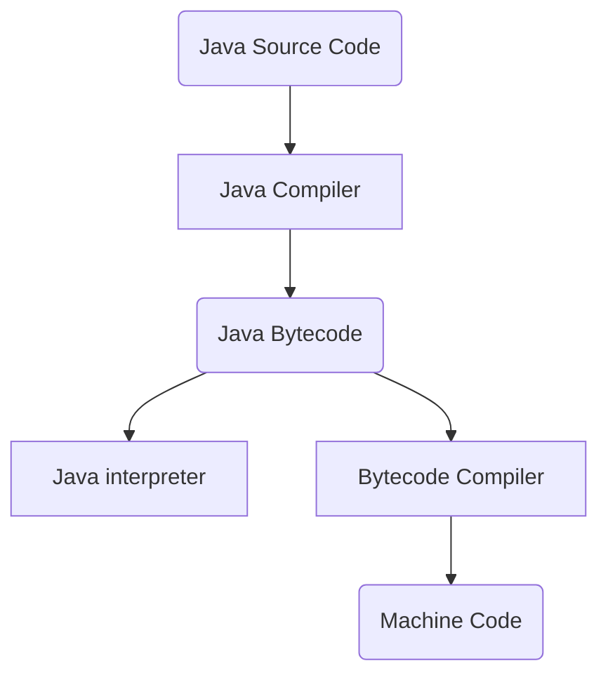
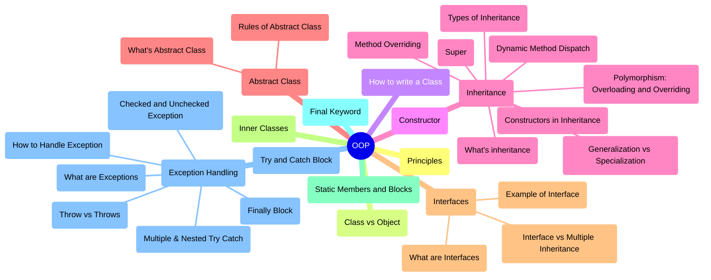

<center>  <h1>  About Java language  </h1> </center>

## 1. Table of Contents

<details>
<summary>Expand contents</summary>

- [1. Table of Contents](#1-table-of-contents)
- [2. Data Types and Variables](#2-data-types-and-variables)
  - [2.1. Data types](#21-data-types)
  - [2.2. Variables](#22-variables)
  - [2.3. Rules for naming variable](#23-rules-for-naming-variable)
  - [2.4. Literals](#24-literals)
- [3. Features and Architecture](#3-features-and-architecture)
  - [3.1. Compiler vs Interpreter](#31-compiler-vs-interpreter)
  - [3.2. Java is Platform Independent](#32-java-is-platform-independent)
  - [3.3. JVM Architecture](#33-jvm-architecture)
  - [3.4. Feature of Java](#34-feature-of-java)
- [4. Operator and Expressions](#4-operator-and-expressions)
  - [4.1. Arithmetic Operators](#41-arithmetic-operators)
  - [4.3. Assignment Operator](#43-assignment-operator)
  - [4.4. Relational Operators](#44-relational-operators)
  - [4.5. Logical Operators](#45-logical-operators)
  - [4.6. Ternary Operator](#46-ternary-operator)
  - [4.7. Bitwise Operators](#47-bitwise-operators)
  - [4.8. Shift Operators](#48-shift-operators)
- [5. String Class](#5-string-class)
- [6. Conditional Statements](#6-conditional-statements)
  - [6.1. if statement](#61-if-statement)
  - [6.2. nested if statement](#62-nested-if-statement)
  - [6.3. if-else statement](#63-if-else-statement)
  - [6.4. if-else-if statement](#64-if-else-if-statement)
  - [6.5. switch case statement](#65-switch-case-statement)
- [7. Loops](#7-loops)
  - [7.1. while loop](#71-while-loop)
  - [7.2. do-while loop](#72-do-while-loop)
  - [7.3. For loop](#73-for-loop)
  - [7.4. enhanced for loop](#74-enhanced-for-loop)
- [8. Arrays](#8-arrays)
  - [8.1. Arrays class](#81-arrays-class)
  - [8.2. 1D Array](#82-1d-array)
  - [8.3. 2D Array](#83-2d-array)
- [9. Methods](#9-methods)
  - [9.1. writing methods](#91-writing-methods)
  - [9.2. passing object as parameters](#92-passing-object-as-parameters)
  - [9.3. parameter passing](#93-parameter-passing)
  - [9.4. variable arguments](#94-variable-arguments)
  - [9.5. command line arguments](#95-command-line-arguments)
  - [9.6. recursion](#96-recursion)
  - [9.7. methods overloading](#97-methods-overloading)
- [10. Object-Oriented Programming](#10-object-oriented-programming)
  - [10.1. Principles of OOP](#101-principles-of-oop)
  - [10.2. Class vs Object](#102-class-vs-object)
  - [10.3. How to write a Class](#103-how-to-write-a-class)
  - [10.4. Constructor](#104-constructor)
  - [10.5. Inheritance](#105-inheritance)
    - [10.5.1. Generalization vs Specialization](#1051-generalization-vs-specialization)
    - [10.5.2. What's inheritance](#1052-whats-inheritance)
    - [10.5.3. Constructors in Inheritance](#1053-constructors-in-inheritance)
    - [10.5.4. this is super](#1054-this-is-super)
    - [10.5.5. types of inheritance](#1055-types-of-inheritance)
    - [10.5.6. Method overriding](#1056-method-overriding)
    - [10.5.7. dynamic method dispatch](#1057-dynamic-method-dispatch)
    - [10.5.8. polymorphism using overloading and overriding](#1058-polymorphism-using-overloading-and-overriding)
  - [10.6. Abstract class](#106-abstract-class)
    - [10.6.1. What's abstract class](#1061-whats-abstract-class)
    - [10.6.2. rules of abstract class](#1062-rules-of-abstract-class)
  - [10.7. Interfaces](#107-interfaces)
    - [10.7.1. What are interfaces](#1071-what-are-interfaces)
    - [10.7.2. example of interface](#1072-example-of-interface)
    - [10.7.3. Interface vs multiple inheritance](#1073-interface-vs-multiple-inheritance)
  - [10.8. Inner Classes](#108-inner-classes)
  - [10.9. Static members and Blocks](#109-static-members-and-blocks)
  - [10.10. final keyword](#1010-final-keyword)
  - [10.11. Exception Handling](#1011-exception-handling)
    - [10.11.1. what are exceptions](#10111-what-are-exceptions)
    - [10.11.2. how to handle exception](#10112-how-to-handle-exception)
    - [10.11.3. try and catch block](#10113-try-and-catch-block)
    - [10.11.4. multiple \& nested try catch](#10114-multiple--nested-try-catch)
    - [10.11.5. checked and unchecked exception](#10115-checked-and-unchecked-exception)
    - [10.11.6. throw vs throws](#10116-throw-vs-throws)
    - [10.11.7. finally block](#10117-finally-block)
- [11. Multithreading](#11-multithreading)
  - [11.1. What are Multiprogramming](#111-what-are-multiprogramming)
  - [11.2. Multithreading using Thread Class](#112-multithreading-using-thread-class)
  - [11.3. Multithreading using Runnable Interface](#113-multithreading-using-runnable-interface)
  - [11.4. States of a Thread](#114-states-of-a-thread)
  - [11.5. Thread Priorities, Thread Class](#115-thread-priorities-thread-class)
  - [11.6. Thread Methods: Constructors, sleep \& Interrupt](#116-thread-methods-constructors-sleep--interrupt)
  - [11.7. Thread: Daemon, join and yield](#117-thread-daemon-join-and-yield)
  - [11.8. What is Synchronization](#118-what-is-synchronization)
  - [11.9. What is a Monitor](#119-what-is-a-monitor)
  - [11.10. Multithreading using Monitor](#1110-multithreading-using-monitor)
  - [11.11. Inter-Thread Communication](#1111-inter-thread-communication)
- [12. JAVA IO Streams](#12-java-io-streams)
  - [12.1. What are Streams](#121-what-are-streams)
  - [12.2. InputStream and OutputStream](#122-inputstream-and-outputstream)
  - [12.3. FileOutputStream](#123-fileoutputstream)
  - [12.4. FileInputStream \& FileReader](#124-fileinputstream--filereader)
  - [12.5. Buffered Streams and Buffered Reader](#125-buffered-streams-and-buffered-reader)
  - [12.6. Piped Streams](#126-piped-streams)
  - [12.7. Random Access File](#127-random-access-file)
  - [12.8. Data Streams](#128-data-streams)
  - [12.9. Serialization](#129-serialization)
- [13. Java Generics](#13-java-generics)
  - [13.1. Introduction to Generics](#131-introduction-to-generics)
  - [13.2. Generic Methods](#132-generic-methods)
- [14. Collection Framework](#14-collection-framework)
  - [14.1. What are Collections?](#141-what-are-collections)
  - [14.2. Why Collections are Required?](#142-why-collections-are-required)
  - [14.3. Collection Classes in Java HashMap and its Internal Working](#143-collection-classes-in-java-hashmap-and-its-internal-working)
  - [14.4. HashSet, Treeset](#144-hashset-treeset)
  - [14.5. Compare Interface](#145-compare-interface)
  - [14.6. LinkedHashSet](#146-linkedhashset)
  - [14.7. BitSet](#147-bitset)
  - [14.8. Arrays and Comparator](#148-arrays-and-comparator)
- [15. JDBC (Java Database Connectivity)](#15-jdbc-java-database-connectivity)
  - [15.1. JDBC Drivers](#151-jdbc-drivers)
  - [15.2. Writing JDBC Programming](#152-writing-jdbc-programming)
  - [15.3. DML (Data Manipulation Language) using JDBC](#153-dml-data-manipulation-language-using-jdbc)
  - [15.4. DDL (Data Definition Language) using JDBC](#154-ddl-data-definition-language-using-jdbc)

</details>

## 2. Data Types and Variables

### 2.1. Data types

- Primitive Data Type: boolean, char, int, short, byte, long, float, double

- Non-Primitive Data Type or Object Data Type: String, Array, ...

```tree
    Data Types in Java
    |
    ├── Primitive Data Types    
    │   ├── Non Numeric Type
    │   │   ├── boolean (8 bits)
    │   │   └── char (16 bits)
    │   └── Numeric Type
    │       ├── Integer
    |       |   ├── byte (8 bits)
    |       |   ├── short (16 bits)
    |       |   ├── int (32 bits)
    |       |   └── long (64 bits)
    │       └── Floating Point
    |           ├── float (32 bits)
    |           └── double (64 bits)
    └── Non-Primitives Types
        ├── String (an array of characters)
        ├── Array (groups of like-types variables)
        ├── Class (user-defined blueprint or prototype from which object: modifiers, class name, super class if any, interfaces if any, body)
        ├── Object (basic unit of Object-Oriented, An object consists of : state, behavior, identity)
        └── Interface (have methods and variables: only method signature, no body)

```

### 2.2. Variables

- is a name given to a memory location.
- is the basic unit of storage in a program.
- the value stored in a variable can be changed during program execution.
- all the operations done on the variable affect that memory location.
- all variables must be declared before use.
- Variables are the containers in Java that can store data values inside them, during Java program execution.

- declare variables:

    ```java
        datatype data_name;
        // datatype: type of data that can be stored in this variable
        // data_name: name was given to the variable

        int time;
        float price;
        char var;
    ```

- initialize variables:

    ```java
        datatype variable_name value;
        // datatype: type of data that can be stored in this variable
        // variable_name: name was given to the variable
        // value: the initial value stored in the variable

        int time = 10;
        char var = 'a';
    ```

- Types of variables
  - local variable
  - instance variable
  - static variable

    ```tree
      Type of variable
      |
      ├── Local variables
      |   ├── are created when the block is entered, or the function is called
      |   ├── are destroyed after exiting from the block or when the call returns from the function.
      |   ├── the scope of variables exists only within the block in which the variables are declared 
      |   └── Initialization of the local variable is mandatory before using it in the defined scope
      |
      ├── Instance variables
      |   ├── non-static variables, declared in a class outside of any method, constructor, block
      |   ├── unlike local variable,we may use access specifiers for instance variables, if do not specify any access specifier, then the default access specifier will be used
      |   ├── Initialization of an instance variable is not mandatory, default value: String is null, float is 0.0f, int is 0, Integer is null, etc.
      |   ├── can be accessed only by creating objects
      |   └── initialize instance variables using constructors while creating an object, or use instance blocks to initialize the instance variables
      |
      └── Static variables (also known as class variables)
          ├── declared similarly to instance variables, difference: declared using the static keyword within a class outside of any method, constructor, or block.
          ├── unlike instance variable, we can only have one copy of a static variable per class, irrespective of how many object we create
          ├── created at the start of program execution and destroyed automatically when execution ends.
          ├── Initialization of a static variable is like instance variable
          ├── access a static variable like an instance variable(through an object)
          ├── cannot be declared locally inside an instance method.
          └── Static blocks can be used to initialize static variables.
    ```

    ```java
        class Example
        {
            // Static variable
            static int a; 
            
            // Instance variable
            int b;        
        } 
    ```

### 2.3. Rules for naming variable

- name can consist of Capital letters A-Z, lowercase letters a-z digits 0-9, and 2 spacial characters such as underscore (_) and dollar sign ($).
- the first character must not be a digits
- blank space cannot be used
- java keywords cannot be used as variable name
- variable name are case-sensitive
- not limit on the length of a variable name but by convention, it should be between 4 to 15 chars
- always should exist on the left-hand side of assignment operators.

### 2.4. Literals

## 3. Features and Architecture

### 3.1. Compiler vs Interpreter

- Compiler takes entire program and converts it into object code which is typically stored in a file. The object code is also referred as binary code and can be directly executed by the machine after linking. Examples of compiled programming languages are C and C++.
- Interpreter directly executes instructions written in a programming or scripting language without previously converting them to an object code or machine code. Examples of interpreted languages are Perl, Python and Matlab.

- Both compilers and interpreters convert source code (text files) into tokens, both may generate a parse tree, and both may generate immediate instructions. The basic difference is that a compiler system, including a (built in or separate) linker, generates a stand alone machine code program, while an interpreter system instead performs the actions described by the high level program.

- Once a program is compiled, its source code is not useful for running the code. For interpreted programs, the source code is needed to run the program every time.

- In general, interpreted programs run slower than the compiled programs.

- Java programs are first compiled to an intermediate form, then interpreted by the interpreter.

### 3.2. Java is Platform Independent

- Java compiled code(byte code) can run on all operating systems.



As JVM is not platform-independent because of which Java is not considered completely platform-independent.

### 3.3. JVM Architecture

- JVM(Java Virtual Machine) acts as a run-time engine to run Java applications. JVM is the one that actually calls the main method present in a Java code. JVM is a part of JRE(Java Runtime Environment).
- Java applications are called WORA (Write Once Run Anywhere). This is all possible because of JVM

  ```mermaid
  block-beta
    columns 5
    doc>"Class Loader"]:5
    space space blockArrowId<[" "]>(y) space space

  block:e:5
          l["Method Area"]
          h["Heep"]
          jvm["JVM Language Stacks"]
          pc["PC Registers"]
          r["Native Method Stacks"]
  end
    blockArrowId1<[" "]>(y)  space space space space
    ex space method
    ex["Execution Engine"]  --> method["Native Method Interface"]
    method["Native Method Interface"] --> ex["Execution Engine"] 
    method space nt
    method["Native Method Interface"] --> nt["Native Method Libraries"]
    nt["Native Method Libraries"] --> method["Native Method Interface"]

    style e stroke-width:10px
  ```
  
### 3.4. Feature of Java

## 4. Operator and Expressions

### 4.1. Arithmetic Operators

|  Operators | Result  |
|:---:|---|
| +  | Addition of two numbers  |
| -  | Subtraction of two numbers  |
| *  | Multiplication of two numbers  |
| /  | Division of two numbers  |
| %  | (Modulus Operator) Divides two numbers and returns the remainder |

### 4.3. Assignment Operator

- Operator 1: Unary minus (-)

  ```java
    - (operand)
      int a = -10;
  ```

- Operator 2: 'NOT' Operator (!)

  ```java
    !(operand)
    boolean condition = !true;
  ```

- Operator 3: Increment (++)
  
  ```java
    //- post-increment operator
    num++;
    //- pre-increment operator
    ++num;
  ```

- Operator 4: Decrement (--)
  
  ```java
    // post-decrement operator
    num--;
    // pre-decrement operator
    --num;
  ```

- Operator 5: Bitwise Complement (~)

  ```java
    ~(operand)
    int n = 6;
    int m = ~n; 
    // 6 = 0000 0110 -> 1111 1001
    // 1111 1001 -> 0000 0110 + 1 -> 0000 0111 = -7  
  ```

### 4.4. Relational Operators

  ```java
    // syntax: variable1 relation_operator variable2
  ```

- Operator 1: "Equal to" operator (==)
  
    ```java
      // syntax: var1 == var2
      int var1 = 10;
      int var2 = 6;
      System.out.print((var1 == var2)); // false
    ```

- Operator 2: "Not equal to" operator (!=)
  
  ```java
    // syntax: var1 != var2
      int var1 = 10;
      int var2 = 6;
      System.out.print((var1 != var2)); // true
  ```

- Operator 3: "Greater than" operator (>)

    ```java
      // syntax: var1 > var2
      int var1 = 10;
      int var2 = 6;
      System.out.print((var1 > var2)); // true
    ```

- Operator 4: "Less than" operator (<)
  
    ```java
      // syntax: var1 < var2
      int var1 = 10;
      int var2 = 6;
      System.out.print((var1 < var2)); // false
    ```

- Operator 5: Greater than or equal to (>=)

  ```java
    // syntax: var1 >= var2
    int var1 = 10;
    int var2 = 6;
    int var3 = 6;
    System.out.print((var1 >= var2)); // true
    System.out.print((var2 >= var3)); // true
  ```

- Operator 6: Less than or equal to (<=)
  
  ```java
    // syntax: var1 <= var2
    int var1 = 10;
    int var2 = 6;
    int var3 = 6;
    System.out.print((var1 <= var2)); // false
    System.out.print((var2 <= var3)); // true
  ```

### 4.5. Logical Operators

- AND Operator ( && ) – if( a && b ) [if true execute else don’t]
- OR Operator ( || ) – if( a || b) [if one of them is true to execute else don’t]
- NOT Operator ( ! ) – !(a < b) [returns false if a is smaller than b]

### 4.6. Ternary Operator

  ```java
    // syntax:
    // variable = expression1 ? expression2: expression3
    // if(expression1)
    // {
    //   variable = expression2;
    // }
    // else
    // {
    //   variable = expression3;
    // }

  ```

### 4.7. Bitwise Operators

- bitwise or (|): if either of the bits is 1, it gives 1, else it shows 0.
- bitwise and (&): if both bits are 1, it gives 1, else it shows 0.
- bitwise xor (^): if corresponding bits are different, it gives 1, else it shows 0.
- bitwise complement (~): all bits inverted, which means it makes every 0 to 1, and every 1 to 0. Compiler will give 2's complement of that number
- bit-shift operators (shift operators)

  - signed right shift operator (>>)
  - unsigned right shift operator (>>>)
  - left shift operator (<<)

### 4.8. Shift Operators

| Name of operator              | Sign | Description |
| :---------------- | :------: | :---- |
| signed left shift       |   <<   | The left shift operator moves all bits by a given number of bits to the left. |
| signed right shift           |   >>   | The right shift operator moves all bits by a given number of bits to the right. |
| unsigned right shift | >>> | it is the same as the signed right shift, but the vacant leftmost position is filled with 0 instead of the sign bit. |

## 5. String Class

## 6. Conditional Statements

### 6.1. if statement

### 6.2. nested if statement

### 6.3. if-else statement

### 6.4. if-else-if statement

### 6.5. switch case statement

## 7. Loops

### 7.1. while loop

### 7.2. do-while loop

### 7.3. For loop

### 7.4. enhanced for loop

## 8. Arrays

### 8.1. Arrays class

### 8.2. 1D Array

### 8.3. 2D Array

## 9. Methods

### 9.1. writing methods

### 9.2. passing object as parameters

### 9.3. parameter passing

### 9.4. variable arguments

### 9.5. command line arguments

### 9.6. recursion

### 9.7. methods overloading

## 10. Object-Oriented Programming



```tree
    Object-Oriented Programming
    |
    ├── Principles
    ├── Class vs Object
    ├── How to write a Class
    ├── Constructor
    ├── Inheritance   
    │   ├── Generalization vs Specialization
    │   ├── What is inheritance 
    │   ├── Constructors in Inheritance 
    │   ├── Super  
    │   ├── Types of Inheritance
    │   ├── Method Overriding  
    │   ├── Dynamic Method Dispatch   
    │   └── Polymorphism: Overloading and Overriding
    ├── Abstract Class     
    |   ├── What is Abstract Class
    |   └── Rules of Abstract Class
    ├── Interfaces
    │   ├── What are Interfaces
    │   ├── Example of Interface
    │   └── Interface vs Multiple Inheritance
    ├── Inner Classes     
    ├── Static Members and Blocks       
    ├── Final Keyword             
    └── Exception Handling
       ├── What are Exceptions
       ├── How to Handle Exception
       ├── Try and Catch Block
       ├── Multiple & Nested Try Catch
       ├── Checked and Unchecked Exception
       ├── Throw vs Throws
       └── Finally Block
```

### 10.1. Principles of OOP

### 10.2. Class vs Object

### 10.3. How to write a Class

### 10.4. Constructor

### 10.5. Inheritance

#### 10.5.1. Generalization vs Specialization

#### 10.5.2. What's inheritance

#### 10.5.3. Constructors in Inheritance

#### 10.5.4. this is super

#### 10.5.5. types of inheritance

#### 10.5.6. Method overriding

#### 10.5.7. dynamic method dispatch

#### 10.5.8. polymorphism using overloading and overriding

### 10.6. Abstract class

#### 10.6.1. What's abstract class

#### 10.6.2. rules of abstract class

### 10.7. Interfaces

#### 10.7.1. What are interfaces

#### 10.7.2. example of interface

#### 10.7.3. Interface vs multiple inheritance

### 10.8. Inner Classes

### 10.9. Static members and Blocks

### 10.10. final keyword

### 10.11. Exception Handling

#### 10.11.1. what are exceptions

#### 10.11.2. how to handle exception

#### 10.11.3. try and catch block

#### 10.11.4. multiple & nested try catch

#### 10.11.5. checked and unchecked exception

#### 10.11.6. throw vs throws

#### 10.11.7. finally block

## 11. Multithreading

### 11.1. What are Multiprogramming

### 11.2. Multithreading using Thread Class

### 11.3. Multithreading using Runnable Interface

### 11.4. States of a Thread

### 11.5. Thread Priorities, Thread Class

### 11.6. Thread Methods: Constructors, sleep & Interrupt

### 11.7. Thread: Daemon, join and yield

### 11.8. What is Synchronization

### 11.9. What is a Monitor

### 11.10. Multithreading using Monitor

### 11.11. Inter-Thread Communication

## 12. JAVA IO Streams

### 12.1. What are Streams

### 12.2. InputStream and OutputStream

### 12.3. FileOutputStream

### 12.4. FileInputStream & FileReader

### 12.5. Buffered Streams and Buffered Reader

### 12.6. Piped Streams

### 12.7. Random Access File

### 12.8. Data Streams

### 12.9. Serialization

## 13. Java Generics

### 13.1. Introduction to Generics

### 13.2. Generic Methods

## 14. Collection Framework

### 14.1. What are Collections?

### 14.2. Why Collections are Required?

### 14.3. Collection Classes in Java HashMap and its Internal Working

### 14.4. HashSet, Treeset

### 14.5. Compare Interface

### 14.6. LinkedHashSet

### 14.7. BitSet

### 14.8. Arrays and Comparator

## 15. JDBC (Java Database Connectivity)

### 15.1. JDBC Drivers

### 15.2. Writing JDBC Programming

### 15.3. DML (Data Manipulation Language) using JDBC

### 15.4. DDL (Data Definition Language) using JDBC
